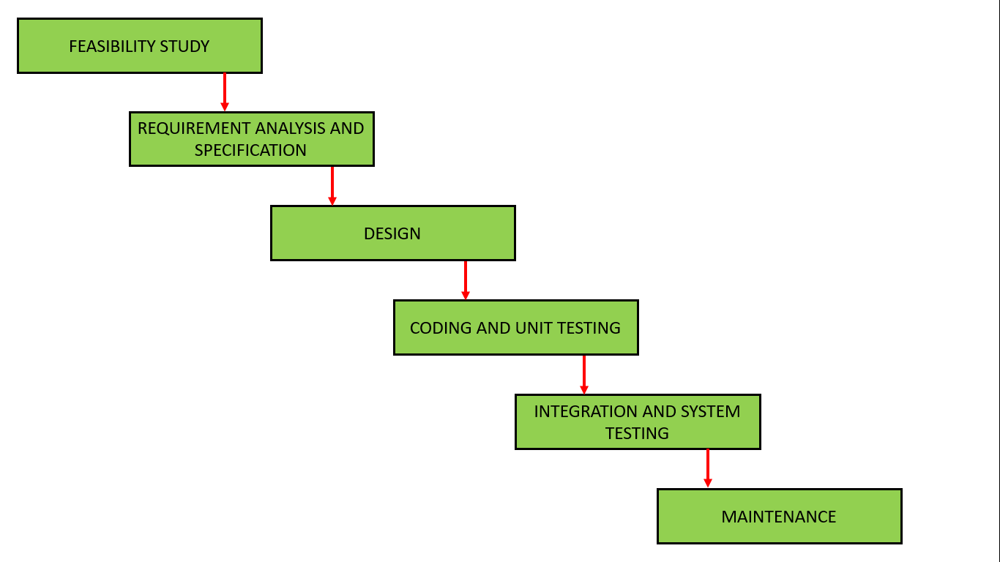

# Introduction To DevOps

### History/Need :book:

- The IT operations, QA, and development teams in an organization have one common goal and that is the overall success of the organization. 
- They also their work flow to run smoothly without any disruption to achieve stability, reliability, availability, and security. 
- By using automated tools, these teams work independently without depending on other teams. 
- Through this, development, testing and deployment becomes easier and smooth 

### Brief history of DevOps

- During the **1970s and 1980s**, most new features required one to five years to develop and deploy, often costing tens of millions of dollars.  
- By the **2000’s**, because of advances in technology , the time required to develop new functionality had
  dropped to weeks or months, but deploying into production would still require weeks or months.
- By **2010**, a new approach called DevOps was introduced, which made it easier and faster to create and deploy new software features. Thanks to advancements in technology, including the cloud, it became possible to create and launch new startups in just a few weeks. This made deployment of software much faster and less risky for companies.  

### What is DevOps?

- DevOps stands for Development and Operations.
- It is an approach, a methodology, a culture where teams simultaneously and efficiently work smoothly.

- The development team plans and build the code and run tests and then passes it to the operations team for deployment, further operations and monitoring.
- This process is automated and integrated through DevOps continuously.
- Automated workflow and continuous integration.

### What is DevOps Culture?

DevOps culture refers to the set of values, beliefs, and practices that underpin the DevOps methodology. DevOps culture emphasizes collaboration, communication, and a focus on delivering value to customers. Here are some key aspects of DevOps culture:

1. **Collaboration and Communication**: DevOps culture emphasizes collaboration and communication between development and operations teams, as well as with other teams such as quality assurance and security.
2. **Continuous Improvement**: DevOps culture emphasizes a mindset of continuous improvement, with a focus on experimentation, learning, and iteration..
3. **Automation**: DevOps culture emphasizes the use of automation to streamline and accelerate the software delivery process. Automation helps to reduce manual errors, increase speed and reliability, and free up time for teams to focus on higher-value work.
4. **Customer Focus**: DevOps culture emphasizes a customer-centric approach, with a focus on delivering value to customers quickly and efficiently. Teams are encouraged to work closely with customers to understand their needs and to deliver solutions that meet those needs.
5. **Shared Responsibility**: DevOps culture emphasizes shared responsibility for the entire software delivery process, from development to deployment and beyond. This means that everyone is accountable for the quality, security, and reliability of the software, and that teams work together to address issues as they arise.

### DevOps Loop Model

1. **Continuous Exploration**: This stage involves gathering feedback from customers, stakeholders, and market trends to identify new opportunities for innovation and improvement. This can include market research, user surveys, etc.
2. **Continuous Integration**: In this stage, code changes from multiple developers are combined and tested together to ensure that they do not introduce conflicts or errors. This stage includes automated testing and continuous integration to ensure that the code is stable and can be deployed to production.
3. **Continuous Delivery**: In this stage, the code is automatically packaged and prepared for deployment to production.
4. **Continuous Deployment**: This stage involves the automatic release of code changes to production. This requires a high degree of automation and monitoring to ensure that any issues are quickly detected and resolved.
5. **Continuous Operations**: This stage involves monitoring and maintaining the production environment to ensure that the application is performing as expected. This includes monitoring performance, detecting and resolving issues, and scaling resources as needed.
6. **Continuous Feedback**: This stage involves gathering feedback from customers and stakeholders to inform future improvements and innovation.

### SDLC

- Software Development Life Cycle(SDLC) is a set of methodologies or approaches used in software development. 
- Contains the stages or steps in a specific order while development of software. 
- The stages include planning, testing, design, development and testing. 
- SDLC models are used by software development teams to meet the requirements of customers and company standards.

Some of the most popular SDLC models include:

1. Waterfall Model
2. Agile Model
3. Spiral Model
4. V-Model
5. Iterative Model

### Waterfall Model:

- The Waterfall Model is a linear sequential flow. 
- As the name suggests, progress flow steadily downwards (like a waterfall) through the phases of software implementation. 
- Any phase in the development process begins only if the previous phase is complete. 
- There is no way to get back to previous phase once its done.
- The usage of the waterfall model can fall under the projects which do not focus on changing the requirements.

#### Stages of Waterfall model

1. **Feasibility Study**: Determines whether the project is financially and technically feasible or not.
2. **Requirements analysis and specification**: All the requirements are understood in this phase and a SRS(Software Requirements Specification) document is also made. All the requirements regarding the software are gathered from the customer to meet their requirements.
3. **Design**: The requirement specifications from first phase are studied in this phase and the system design. The requirements in the SRS are converted into a format that can be coded in a programming language. A Software Design Document is used to document all of this effort (SDD).
4. **Coding and Unit testing**: After the design phase, coding starts and each modules is coded and individually tested referred as unit testing. Each designed module is coded and tested whether it is working properly or not.
5. **Integration and System testing**: All the modules in previous stage which are successfully coded and tested are now integrated together and the whole system is tested to determine whether the complete system is working fine or not after integration.
6. **Maintenance**: Maintenance is the most important phase of a software life cycle. The effort spent on maintenance is 60% of the total effort spent to develop a full software.

|                       Advantages                        |                        Disadvantages                         |
| :-----------------------------------------------------: | :----------------------------------------------------------: |
|                     Simple and Easy                     |                         Rigid model                          |
|                  Base for other models                  |                    No changes/experiments                    |
| Requirements are very well documented, clear and fixed. |                        No parallelism                        |
|         Stages and activities are well defined          | It takes the full lifecycle to deliver a workable solution to the customer |

