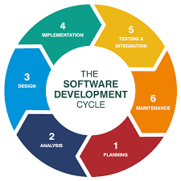

# SDLC

- Software Development Life Cycle(SDLC) is a set of methodologies or approaches used in software development. 
- Contains the stages or steps in a specific order while development of software. 
- The stages include planning, testing, design, development and testing. 
- SDLC models are used by software development teams to meet the requirements of customers and company standards.

Some of the most popular SDLC models include:

1. Waterfall Model
2. Agile Model
3. Spiral Model
4. V-Model
5. Iterative Model

