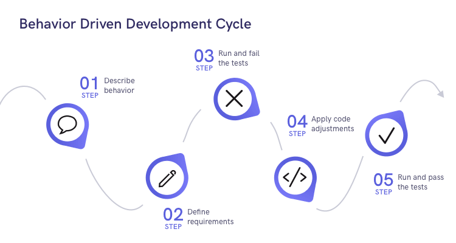

### Minimum Viable Product

- MVP is a product with features to attract customers and to validate idea behind the product. It is created with minimum set of requirements to satisfy the customers and to take feedback quickly. 
- It helps to take feedback early on and to iterate and improve the product in future.
- As agile methodologies suggest to iterate product and continuous feedback from the customer, MVP plays an important role in agile development.
- MVP includes minimum requirements for the customer to solve a problem so that it can be released to beta testers who provides feedback. The feedback is then used to improve product features and functionality.
- Through the initial feedback, MVP can help reduce the risk of failure because the initial idea is validated before committing to large budget and complete development cycle.

### Test-Driven Development

Test-Driven Development, TDD is a software development methodology in which the code is written in response to a test case meaning that test in written before the code.  

Automated tests are written for each functionality and then the code is written to validate those tests. If the test fails, then new code is written.

TDD asks to write a failing test case first and then a piece of code which satisfies the test case so that it passes. TDD emphasizes to correct failed tests before writing new code as it avoids duplication. TDD involves the following steps:

1. **Write a failing test case**: Before writing any code, the developer writes a test case that describes the behavior they want to implement in the code. The test case should verify that the code behaves as expected when given a particular input or set of inputs. At this stage, the test case should fail because the code has not yet been written to implement the desired behavior.
2. **Write the minimum amount of code to make the test pass**: Once the test case has been written, the developer writes the minimum amount of code necessary to make the test pass. This code should be simple and straightforward and should only implement the functionality necessary to pass the test. This step is sometimes referred to as "coding to the test."
3. **Refactor the code**: Once the test case is passed, the developer refactors the code to improve its design, maintainability, and performance. This step involves making changes to the code that do not affect its behavior but make it easier to read, understand, and modify in the future.
4. **Repeat the process**: The developer repeats the process for each new piece of functionality required by the software. By following this cycle repeatedly, the developer can iteratively build and improve the codebase while ensuring that it always meets the requirements of the project.

### Behavior-Driven Development

- Behavior-Driven Development ,BDD is an extension of Test-Driven Development (TDD) that aims to improve the communication and collaboration between developers, business stakeholders, and other members of a software development team. 
- BDD is focused on describing the behavior of the system in a way that is easily understandable by all stakeholders, including developers, testers, and business people.
- In BDD, the requirements of a software system are expressed in the form of scenarios, which describe how the system should behave under different conditions. 
- Each scenario is written in a way that is easily understandable by non-technical stakeholders.

- BDD encourages collaboration between members of software development team.
- By using a common language to describe the behavior of the system, developers and other stakeholders can ensure that they are all on the same page and working towards the same goals.

### Difference between TDD and BDD

| TDD                                                          | BDD                                                          |
| ------------------------------------------------------------ | ------------------------------------------------------------ |
| Focuses on testing the functionality of individual code units or modules | Focuses on testing the behavior of the system as a whole     |
| Developer-centric, focused on implementation details         | Business-centric, focused on describing behavior using a common language |
| Test cases are written in code by developers.                | Test cases are written in a structured natural language by all stakeholders |
| Encourages collaboration between developers and testers      | Encourages collaboration between developers, testers, and business stakeholders |
| Helps improve code quality and maintainability.              | It ensures the software meets the needs of the business and is well-designed and maintainable. |

### Why TDD is important for DevOps?

- TDD helps improve the quality of code because it encourages developers to write tests before coding. The code is written for each feature making it more easy to maintain.
- TDD provides early error detection because of automated tests written initially before coding that helps developers to fix the issues early on in the development process.
- TDD requires developers to write automated tests. This helps to ensure that the software is tested thoroughly and consistently, reducing the risk of errors in the production.

