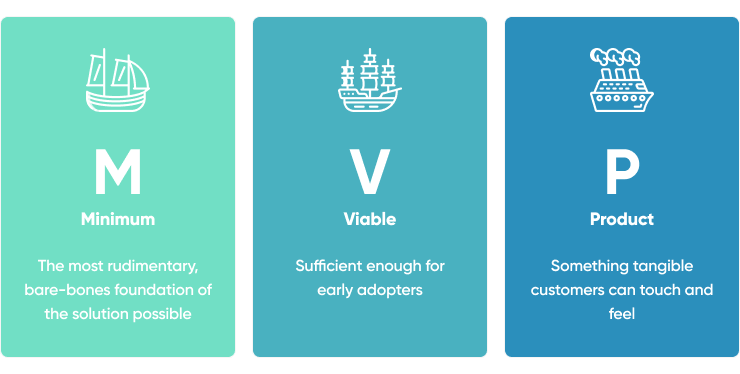

### Minimum Viable Product

- MVP is a product with features to attract customers and to validate idea behind the product. It is created with minimum set of requirements to satisfy the customers and to take feedback quickly. 
- It helps to take feedback early on and to iterate and improve the product in future.
- As agile methodologies suggest to iterate product and continuous feedback from the customer, MVP plays an important role in agile development.
- MVP includes minimum requirements for the customer to solve a problem so that it can be released to beta testers who provides feedback. The feedback is then used to improve product features and functionality.
- Through the initial feedback, MVP can help reduce the risk of failure because the initial idea is validated before committing to large budget and complete development cycle.

