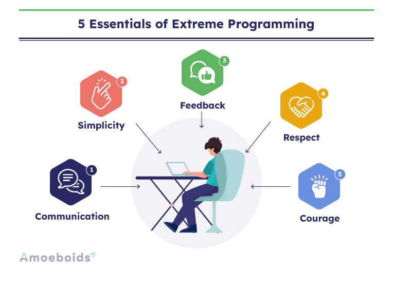

### Extreme Programming Framework

- Agile Software Development Framework.
- Lightweight and flexible with a focus on delivering high quality software.
- Used to improve software quality and responsiveness to customer requirements.
- It suggests taking best practices that have also worked well in the past.

### Key Values/Principles

- **Communication**: As XP emphasizes on teamwork so communication is really essential between teams. XP stresses transfer of knowledge and face to face communication of team members. Communication plays very important role in software development so XP recommends continuous communication.
- **Simplicity**: XP suggests to keep the things simple. Do only what is needed not more. XP focuses on the features that are simple and used immediately then complex features that may never be used. This is done mainly to avoid wastage of time and resources.
- **Feedback**: Continuous feedback is really important in software development to ensure that everything stays on track and the product meet the requirement of customers and stakeholders. Feedback is taken after every iteration to make sure that things are going good and no need to change anything.
- **Courage**: XP encourages development team to take risks by trying new things and learn from mistakes. Courage to make difficult and risky decisions.
- **Respect**:  Every team member is equally treated and respected in order to communicate and collaborate. Every member should be heard and their ideas should be valued.

### Extreme Programming Practices

1. **The Planning Game**: A meeting, a plan phase between different teams that occurs once per iteration. Decisions are made by development, operations and business teams. This also engages customer through which communication is done about their requirements. 
2. **Short Releases**: A simple software is delivered as an initial version and then short releases are made and things are updated with time. This enables customers to give feedback about the releases and make changes if required.
3. **Metaphor**: Describes the system being developed, which helps to create a shared understanding of the project. Explains the system. The metaphor consists of domain related words that are easily understandable by everyone especially development teams.
4. **Simple Design**: The design of the system should be simple. Only the required things should be done without getting into complex approaches which are not really required. Just simple things are kept if they are working fine and all the unnecessary stuff is discarded.
5. **Testing**: XP places a heavy emphasis on testing. Developers write unit tests to ensure that the code works as expected, and automated tests to verify that the system meets the customer's requirements.
6. **Refactoring**: The process in which the design of the system is optimized and improved without changing its functionality. Code is refactored continuously to make sure its manageable and simpler. The code is restructured while retaining its original behavior by removing duplications, using simpler approaches.
7. **Pair Programming**: As the name suggests, the code is written by two developers but on the same machine. The first developer thinks about one approach and its implementation and the second developer thinks that whether the approach used will be implemented successfully or a better approach can be used. This practice helps to improve code quality, promotes knowledge sharing, and reduces errors.
8. **Continuous integration**: XP teams integrate their code frequently to make sure the whole system is working fine or not after integration. This helps in feedback and debugging process. 
9. **Collective code ownership**: The code is shared between XP teams so that anyone can make change as needed. The whole team is responsible for the system and everyone knows what is happening in other parts of the system apart from their own.
10. **Sustainable pace**: XP encourages developers to work at a sustainable pace, which means that they should not work long hours or take on excessive amounts of work. This helps to prevent burnout and ensure that the team can maintain a consistent level of productivity. A maximum work of 45 hours per week is suggested. Overtime is allowed for at most one week.
