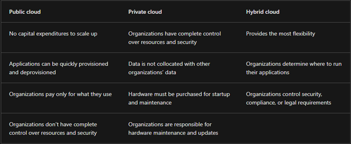
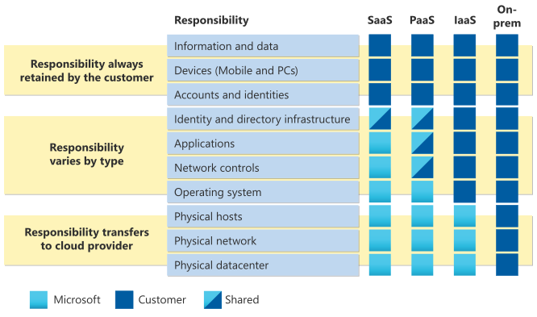

# Cloud Computing

### History/Background

Cloud computing is a model for delivering information technology services in which resources are retrieved from the internet through web-based tools and applications, rather than a direct connection to a server. (Hotspot example)

One reason that cloud computing has become popular is because it allows users to access data and programs over the internet, rather than having to store them on a local hard drive or server. This means that users can access their files and applications from any device with an internet connection, rather than being tied to a specific location or computer.

Before the advent of cloud computing, companies and individuals typically had to invest in and maintain their own hardware and software infrastructure to store and process data. This often required a significant upfront investment and ongoing maintenance costs. With cloud computing, these costs are instead spread out over many users, making it more affordable and scalable for individuals and businesses.

Cloud computing has its roots in the 1960s, when computer scientists began experimenting with ways to share computing resources. The concept of delivering computing resources over the internet, however, did not become practical until the widespread adoption of the internet in the late 1990s.

Since then, cloud computing has become increasingly popular for a number of reasons. One major benefit is cost savings. Because cloud computing providers offer resources on an as-needed basis, users only pay for what they use, rather than having to invest in and maintain their own infrastructure. This can significantly reduce upfront costs and ongoing maintenance expenses.

Another benefit of cloud computing is scalability. With traditional computing models, it can be difficult and expensive to scale up resources to meet increasing demand. With cloud computing, however, users can easily increase or decrease the number of resources they are using, allowing them to meet changing needs quickly and easily.

Cloud computing also offers increased reliability and availability. Because cloud computing resources are distributed across multiple servers, there is less risk of downtime in the event of a single server failure. Additionally, because users can access their resources from any device with an internet connection, they can work from anywhere and always have access to their data and applications.

Overall, cloud computing has revolutionized the way we think about and use computing resources, making it easier and more cost-effective for businesses and individuals to store and process data.

**On-premises:**

​     Own machines, full control, complete responsibility, limited capabilities, upfront cost

**Hosted servers:**

​     Rent machines, less control, less responsibility, limited capabilities, lower cost, pay for fixed capacity if idle.

**Cloud:**

​     Shared infrastructure, scalable, high-level services, pay as you go.

### Cloud computing

Cloud computing is the delivery of computing services over the internet. Computing services include common IT infrastructure such as virtual machines, storage, databases, and networking. Cloud services also expand the traditional IT offerings to include things like Internet of Things (IoT), machine learning (ML), and artificial intelligence (AI).

Because cloud computing uses the internet to deliver these services, it doesn’t have to be constrained by physical infrastructure the same way that a traditional datacenter is. That means if you need to increase your IT infrastructure rapidly, you don’t have to wait to build a new datacenter—you can use the cloud to rapidly expand your IT footprint.

### Cloud Deployment Models

What are cloud models? The cloud models define the deployment type of cloud resources. The three main cloud models are: private, public, and hybrid.

**Private cloud **

Let’s start with a private cloud. A private cloud is, in some ways, the natural evolution from a corporate datacenter. It’s a cloud (delivering IT services over the internet) that’s used by a single entity. Private cloud provides much greater control for the company and its IT department. However, it also comes with greater cost and fewer of the benefits of a public cloud deployment. Finally, a private cloud may be hosted from your onsite datacenter. It may also be hosted in a dedicated datacenter offsite, potentially even by a third party that has dedicated that datacenter to your company.

**Public cloud**

A public cloud is built, controlled, and maintained by a third-party cloud provider. With a public cloud, anyone that wants to purchase cloud services can access and use resources. The public availability is a key difference between public and private clouds.

**Hybrid cloud**

A hybrid cloud is a computing environment that uses both public and private clouds in an inter-connected environment. A hybrid cloud environment can be used to allow a private cloud to surge for increased, temporary demand by deploying public cloud resources. Hybrid cloud can be used to provide an extra layer of security. For example, users can flexibly choose which services to keep in public cloud and which to deploy to their private cloud infrastructure.

The following table highlights a few key comparative aspects between the cloud models.

### Cloud Service Models

#### Infrastructure as a Service

Infrastructure as a service (IaaS) is the most flexible category of cloud services, as it provides you the maximum amount of control for your cloud resources. In an IaaS model, the cloud provider is responsible for maintaining the hardware, network connectivity (to the internet), and physical security. You’re responsible for everything else: operating system installation, configuration, and maintenance; network configuration; database and storage configuration; and so on. With IaaS, you’re essentially renting the hardware in a cloud datacenter, but what you do with that hardware is up to you.

**Shared responsibility model**

The shared responsibility model applies to all the cloud service types. IaaS places the largest share of responsibility with you. The cloud provider is responsible for maintaining the physical infrastructure and its access to the internet. You’re responsible for installation and configuration, patching and updates, and security.

**Scenarios**

Some common scenarios where IaaS might make sense include:

Lift-and-shift migration: You’re standing up cloud resources similar to your on-prem datacenter, and then simply moving the things running on-prem to running on the IaaS infrastructure.

Testing and development: You have established configurations for development and test environments that you need to rapidly replicate. You can stand up or shut down the different environments rapidly with an IaaS structure, while maintaining complete control.

#### Platform as a Service

Platform as a service (PaaS) is a middle ground between renting space in a datacenter (infrastructure as a service) and paying for a complete and deployed solution (software as a service). In a PaaS environment, the cloud provider maintains the physical infrastructure, physical security, and connection to the internet. They also maintain the operating systems, middleware, development tools, and business intelligence services that make up a cloud solution. In a PaaS scenario, you don't have to worry about the licensing or patching for operating systems and databases.

PaaS is well suited to provide a complete development environment without the headache of maintaining all the development infrastructure.

**Shared responsibility model**

The shared responsibility model applies to all the cloud service types. PaaS splits the responsibility between you and the cloud provider. The cloud provider is responsible for maintaining the physical infrastructure and its access to the internet, just like in IaaS. In the PaaS model, the cloud provider will also maintain the operating systems, databases, and development tools. Think of PaaS like using a domain joined machine: IT maintains the device with regular updates, patches, and refreshes.

Depending on the configuration, you or the cloud provider may be responsible for networking settings and connectivity within your cloud environment, network and application security, and the directory infrastructure.

**Scenarios**

Some common scenarios where PaaS might make sense include:

Development framework: PaaS provides a framework that developers can build upon to develop or customize cloud-based applications. Similar to the way you create an Excel macro, PaaS lets developers create applications using built-in software components. Cloud features such as scalability, high-availability, and multi-tenant capability are included, reducing the amount of coding that developers must do.

Analytics or business intelligence: Tools provided as a service with PaaS allow organizations to analyze and mine their data, finding insights and patterns and predicting outcomes to improve forecasting, product design decisions, investment returns, and other business decisions.

#### Software as a Service

Software as a service (SaaS) is the most complete cloud service model from a product perspective. With SaaS, you’re essentially renting or using a fully developed application. Email, financial software, messaging applications, and connectivity software are all common examples of a SaaS implementation.

While the SaaS model may be the least flexible, it’s also the easiest to get up and running. It requires the least amount of technical knowledge or expertise to fully employ.

**Shared responsibility model**

The shared responsibility model applies to all the cloud service types. SaaS is the model that places the most responsibility with the cloud provider and the least responsibility with the user. In a SaaS environment you’re responsible for the data that you put into the system, the devices that you allow to connect to the system, and the users that have access. Nearly everything else falls to the cloud provider. The cloud provider is responsible for physical security of the datacenters, power, network connectivity, and application development and patching.

**Scenarios**

Some common scenarios for SaaS are:

·     Email and messaging.

·     Business productivity applications.

·     Finance and expense tracking.

 

 

 
