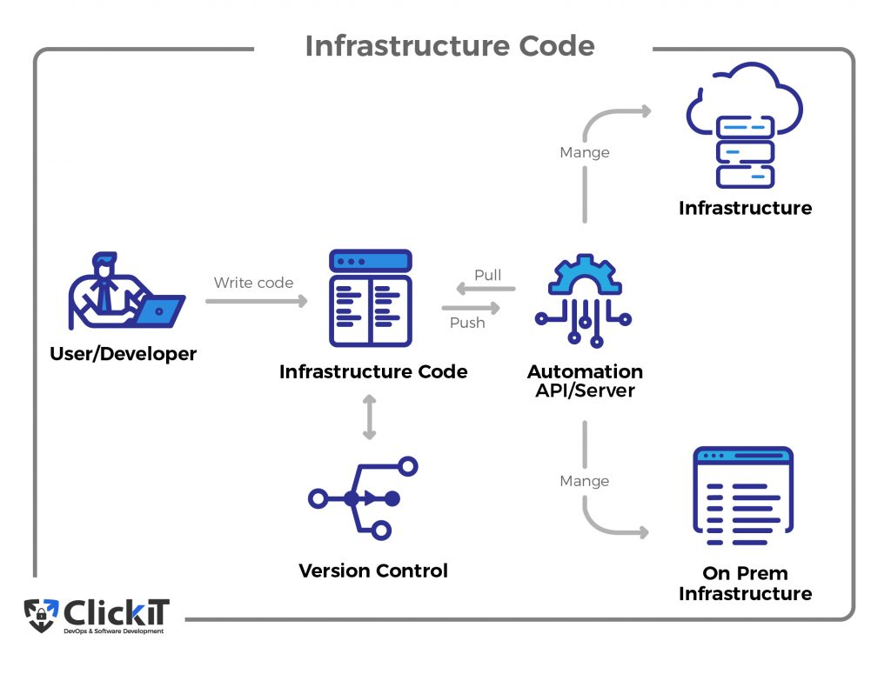

### Infrastructure as Code

- Managing and provisioning of infrastructure through code instead of through manual processes.
- Infrastructure as Code (IaC) is a practice in software development that involves managing and provisioning computing infrastructure through machine-readable definition (configuration) files, rather than manually configuring hardware devices and infrastructure components.
- In other words, it's the process of managing and automating infrastructure resources (e.g., servers, networks, storage) using software development techniques such as version control, continuous integration/continuous deployment (CI/CD), and automated testing.
- IaC to carry out these tasks: Ansible, Puppet, Terraform etc

#### Main tasks in IaC

1. **Infrastructure Provisioning**: Spinning up new servers, network configuration, creating load balancers, configuration on infrastructure level.
2. **Configuration of provisioned infrastructure**: Installing apps on servers, managing those apps, prepare the infrastructure/servers for deployment.
3. **Deployment of application** on provisioned and configured infrastructure.

### IaC Approaches

1. **Imperative**: Defines step-by-step commands/procedure in a specific order needed to achieve the desired configuration.
2. **Declarative**: Defines the desired state of the system, including what resources you need and any properties they should have, and an IaC tool will configure it for you.
3. **Mutable**: Infrastructure resources can be provisioned and configured directly on the infrastructure. Changes can be made directly to the infrastructure resources as needed. May lead to inconsistencies and configuration drift. Quick and direct changes can be made, but may result in unexpected changes and issues.
4. **Immutable**: Complete infrastructure is created in code and deployed as a single, immutable unit. Changes are made by creating a new version of the infrastructure and deploying it. Ensures consistency and reproducibility of infrastructure resources. Requires more effort to create and maintain the code and is expensive, but results in a more stable and predictable infrastructure.

 ### IaC and DevOps

Infrastructure as Code (IaC) is a key practice in DevOps, an essential part of the DevOps approach as it enables the **automation of infrastructure provisioning** and management, which is crucial for achieving the goals of DevOps.

IaC helps to make infrastructure more agile and scalable, allowing teams to deploy infrastructure changes more frequently and with less risk. By automating the process of provisioning and configuring infrastructure resources, IaC reduces the chance of human error and makes it easier to ensure consistency and reproducibility across different environments.

IaC also supports other key practices of DevOps, such as **continuous integration and continuous delivery (CI/CD)**, by enabling automated testing and deployment of infrastructure changes. This allows teams to deliver software and infrastructure changes more frequently and with higher quality, while reducing the risk of errors and downtime.

### Benefits of IaC

1. **Automation**: By using IaC, you can automate the process of provisioning and managing infrastructure resources, making it faster, easier, and more consistent.
2. **Consistency**: With IaC, you can ensure that all infrastructure resources are configured in the same way, avoiding inconsistencies that can lead to errors and downtime.
3. **Scalability**: IaC makes it easy to scale up or down your infrastructure resources based on the needs of your application or business.
4. **Cost savings**: By using IaC, you can save costs by avoiding manual errors and making the best use of cloud resources.
5. **Collaboration**: IaC enables teams to collaborate on infrastructure development using tools such as Git and version control, making it easier to manage and maintain infrastructure resources.

 

 
