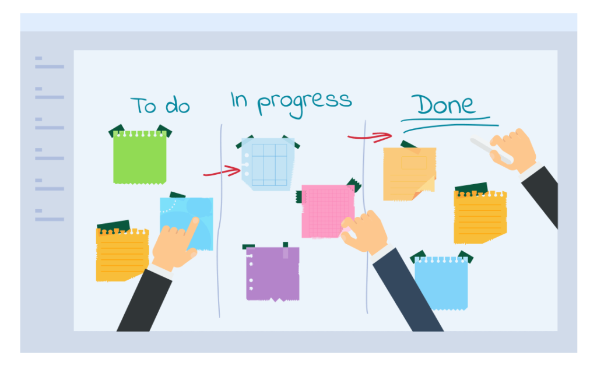

### Kanban

- Japanese word meaning "Sign board", a framework that was originally developed for manufacturing processes.
- Originated from Toyota, Japan as a simple planning system, the aim of which was to control and manage work and inventory at every stage of production optimally.
- Visual management method used in DevOps and Agile as it later being used in software development
- The goal of Kanban is to improve the efficiency and productivity of a team by visualizing work, limiting work in progress, and optimizing workflow.
- Evolutionary method that promotes non-disruptive improvements to an organization processes.
- Main objective is smooth flow of work from start without unnecessary down-time.

### Core practices of Kanban Method

The six core principles of Kanban are:

1. **Visualize the workflow**: Make the workflow visible, so that everyone can see what tasks are in progress, what needs to be done next, and what tasks are completed.
2. **Limit work in progress (WIP)**: Limit the number of tasks that can be in progress at any given time to avoid overloading the team and reduce the time it takes to complete each task. Focus on the current tasks in progress and complete work at hand first before taking up new work.
3. **Manage flow**: Ensure that work moves smoothly through the workflow and is completed in the most efficient and effective way possible.
4. **Make process policies explicit**: Clearly define the process policies and rules that govern how work is done, including how tasks are selected, prioritized, and completed.
5. **Implement feedback loops**: Continually monitor and review the workflow, and use feedback to make improvements and optimize the process.
6. **Improve collaboratively and evolve experimentally**: Continuously improve the workflow by experimenting with new approaches and incorporating feedback from the team, customers, and other stakeholders.

### Kanban Board

A Kanban board is a tool used in the Kanban framework to visualize the work that needs to be done, and the progress of that work. It typically consists of a physical or digital board that is divided into columns representing different stages of work, such as "To Do", "In Progress", and "Done".

In a classic Kanban board model, there are three columns, as shown in the picture above:

- “To Do”: This column lists the tasks that are not yet started. (aka “backlog”)
- “Doing”: Consists of the tasks that are in progress.
- “Done”: Consists of the tasks that are completed.

#### Kanban board Components

**Kanban Cards** – This is the visual representation of tasks. Each card contains information about the task and its status, such as deadline, assignee, description, etc.

**Kanban Columns** – Each column on the board represents a different stage of your workflow. The cards go through the workflow until their full completion.

**Work-in-Progress Limits** – They restrict the maximum amount of tasks in the different stages of the workflow. Limiting WIP allows you to finish work items faster by helping your team focus only on current tasks.

**Kanban Swimlanes** – These are horizontal lanes you can use to separate different activities, teams, classes of service, and more.

**Commitment Point** – A commitment marks a point in the work process where a work item is ready to be pulled into the system.

**Delivery Point** – The point in the workflow where work items are considered finished.
