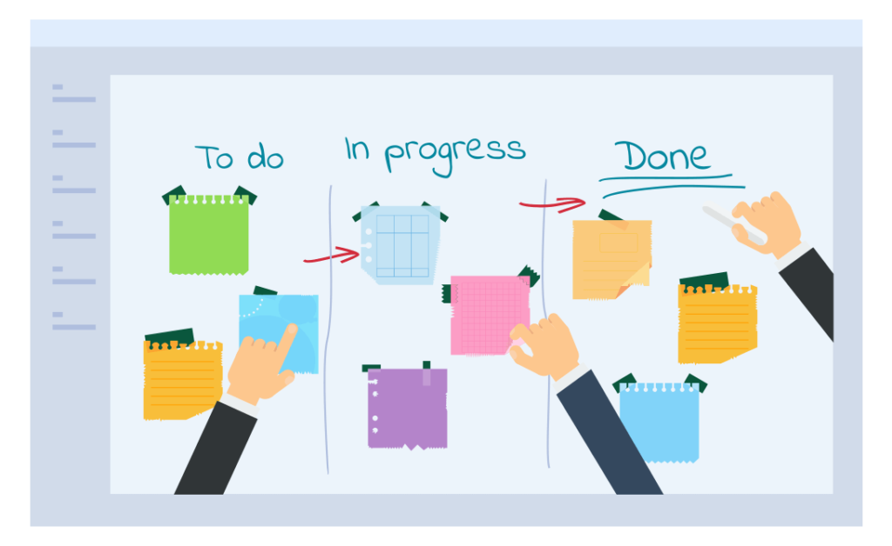
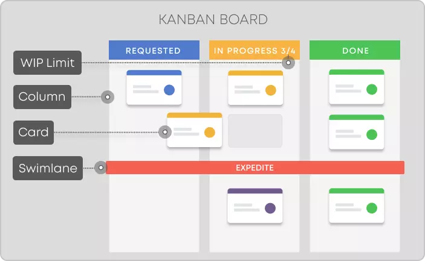

### Scrum

- An agile framework which helps people and teams **deliver value** incrementally in a collaborative way. 
- It is based on the principles of transparency, inspection, and adaptation, and it emphasizes the importance of collaboration, self-organization, and continuous improvement.

### Roles in Scrum

The three main roles in Scrum are the Product Owner, Scrum Master, and Scrum Team. Here's a brief description of each role:

1. **Product Owner**: The Product Owner is responsible for defining and prioritizing the product backlog, which is a list of work items that need to be completed to achieve the project's goals. They work closely with stakeholders to understand their needs and to ensure that the product backlog is aligned with the business objectives. The Product Owner has the final say on what work is done during each sprint, and they are responsible for ensuring that the team is delivering value to the customer.
2. **Scrum Master**: The Scrum Master is responsible for ensuring that the Scrum process is followed and that the team is working efficiently and effectively. They facilitate meetings and ceremonies, such as sprint planning, daily stand-up meetings, sprint reviews, and retrospectives. The Scrum Master helps the team to identify and remove any obstacles that are preventing them from achieving their goals, and they ensure that the team is continuously improving its processes and practices.
3. **Scrum Team**: The Scrum Team is responsible for delivering the work during each sprint. It is a cross-functional team that includes developers, testers, designers, and any other roles necessary to complete the work. The team is self-organizing, which means that they decide how to complete the work and who should work on each task. The Scrum Team is responsible for delivering a potentially shippable product increment at the end of each sprint.

### Steps involved in a scrum process  

1. **Product backlog creation**: The Scrum process starts with the creation of a product backlog, which is a prioritized list of features and requirements that need to be implemented in the product.
2. **Sprint planning**: The team conducts a sprint planning meeting, where they select a subset of items from the product backlog that they will work on during the upcoming sprint. They define the sprint goal and create a sprint backlog, which is a list of tasks that need to be completed to achieve the sprint goal.
3. **Daily stand-up**: The team holds a daily stand-up meeting, where they review their progress, discuss any obstacles or issues they're facing, and plan their work for the next 24 hours.
4. **Sprint review**: At the end of the sprint, the team holds a sprint review meeting, where they present the completed work to the stakeholders and get feedback. The stakeholders can then provide input for the next sprint.
5. **Sprint retrospective**: The team holds a sprint retrospective meeting, where they reflect on the sprint and identify ways to improve their process, practices, and team dynamics. The team uses this feedback to make changes to their process and improve their performance in future sprints.
6. **Increment delivery:** At the end of each sprint, the team delivers a potentially shippable product increment that has been tested and meets the definition of done. This increment is a usable piece of the product that provides value to the customer.
7. **Repeat**: The Scrum process is iterative and continues with the next sprint. The team repeats these steps throughout the project, continuously improving their work and delivering value to the customer.

### Benefits of scrum

6. **Increased productivity**: Scrum encourages teams to work collaboratively and prioritize work items based on value. This focus on productivity can lead to faster delivery of high-quality work.
2. **Improved quality**: Scrum emphasizes continuous improvement and frequent delivery of potentially shippable product increments. This approach enables the team to identify and correct defects early in the development process, resulting in higher quality work.
3. **Better communication and collaboration**: Scrum requires regular meetings and encourages open communication among team members, stakeholders, and customers. This approach fosters collaboration and ensures that everyone is aligned with the project's goals and objectives.
4. **Greater transparency**: Scrum makes work and progress visible to the entire team, which promotes transparency and accountability. This visibility enables the team to identify and address issues early, leading to more predictable outcomes.
5. **Flexibility and adaptability:** Scrum allows teams to adapt to changing requirements and priorities by re-prioritizing the product backlog and adjusting their approach during each sprint. This flexibility helps teams to respond quickly to changes in the market or customer needs.
6. **Increased customer satisfaction**: Scrum focuses on delivering value to the customer by prioritizing work based on their needs and feedback. This approach results in higher customer satisfaction and can help organizations to build better products that meet their customers' needs.

### Kanban Board

A Kanban board is a tool used in the Kanban framework to visualize the work that needs to be done, and the progress of that work. It typically consists of a physical or digital board that is divided into columns representing different stages of work, such as "To Do", "In Progress", and "Done".

In a classic Kanban board model, there are three columns, as shown in the picture above:

- “To Do”: This column lists the tasks that are not yet started. (aka “backlog”)
- “Doing”: Consists of the tasks that are in progress.
- “Done”: Consists of the tasks that are completed.

#### Kanban board Components

**Kanban Cards** – This is the visual representation of tasks. Each card contains information about the task and its status, such as deadline, assignee, description, etc.

**Kanban Columns** – Each column on the board represents a different stage of your workflow. The cards go through the workflow until their full completion.

**Work-in-Progress Limits** – They restrict the maximum amount of tasks in the different stages of the workflow. Limiting WIP allows you to finish work items faster by helping your team focus only on current tasks.

**Kanban Swimlanes** – These are horizontal lanes you can use to separate different activities, teams, classes of service, and more.

**Commitment Point** – A commitment marks a point in the work process where a work item is ready to be pulled into the system.

**Delivery Point** – The point in the workflow where work items are considered finished.
